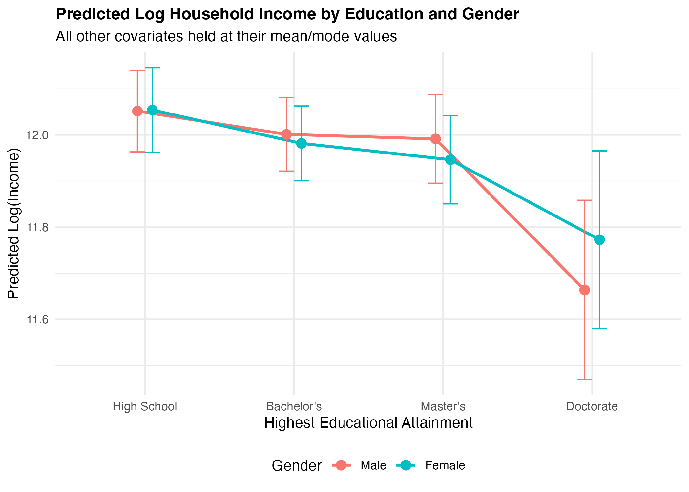

```{r setup, include=FALSE}
knitr::opts_knit$set(root.dir = normalizePath("..")) 
knitr::opts_chunk$set(echo = FALSE, warning = FALSE, message = FALSE) 
library(tidyverse)
```

------------------------------------------------------------------------

## a. Research question and hypotheses

**Research Question:** To what extent do individual educational credentials determine total household income, and how does this economic return vary by gender within the context of structured labor market inequalities?

**Hypotheses:**

-   **H1:** Individuals holding higher tertiary degrees (Master’s and Doctorate) are associated with significantly higher household income compared to those with a High School baseline, reflecting human capital accumulation (Mincer, 1974).

-   **H2:** The positive returns to higher education on household income are conditioned by gender, showing a lower marginal premium for female-headed or female-represented observations due to persistent labor market segregation and systemic wage gaps (Blau & Kahn, 2017).

**Substantive Relevance:** Understanding these dynamics is crucial for education policy and social stratification research, as it illuminates how individual educational sorting interacts with gender disparities to shape broader household-level socio-economic inequality (Goldin, 2014).

## b. Data and variable operationalization

This study utilizes data from a comprehensive income analysis dataset (\~10,000 observations). The unit of analysis is the individual/household. The dependent variable is the natural logarithm of annual income (ln(Income)) to handle right-skewness. The primary independent variable is *Education_Level* (factored into High School as baseline, Bachelor’s, Master’s, and Doctorate). Crucially, acknowledging the dataset’s likely synthetic provenance from Kaggle, the coefficients represent structural economic simulations rather than empirical claims about a specific real-world country. To address household-level confounding identified in preliminary feedback, we control for *Household_Size* and *Marital_Status*. Furthermore, to resolve a linear identity causing near-perfect multicollinearity between age and work experience, we operationalize Mincerian *Potential Experience* (Age – Years of Schooling – 6).

## c. Model choice and statistical justification

To evaluate the returns to education on household income, we estimate two Ordinary Least Squares (OLS) multiple linear regression models. The baseline specification (Model 1) expands the classic Mincerian framework (Mincer, 1974) by modeling log annual income (ln(Y~i~)) as a function of discrete educational tiers, while adjusting for potential non-linear life-cycle impacts through a quadratic experience term, and key sociological confounders:

$\ln(Y_i) = \beta_0 + \sum_{k} \beta_k \text{Education}_{ki} + \beta_1 \text{Exp}_i + \beta_2 \text{Exp}_i^2 + \gamma \mathbf{Z}_i + \varepsilon_i$

where Z~i~ represents a vector of demographic and household controls (*Gender*, *Location*, *Employment_Status*, *Marital_Status* and *Household_Size*).

In preliminary drafts, simultaneously including raw age and work experience introduced severe multicollinearity due to a near-perfect linear identity. To preserve model stability and adhere to methodological recommendations, we operationalize Mincerian *Potential Experience* (Age – Years of Schooling – 6), successfully reducing all Variance Inflation Factors (VIF) to near 1.0. Model 2 extends the baseline by adding an interaction term between educational attainment and gender (Education~*ki*~ ×  Gender~*i*~). This specification is substantively justified by social stratification theories: it relaxes the restrictive assumption that economic returns to higher education are uniform across genders, allowing us to explicitly test whether tertiary degrees yield differential marginal premiums for female-represented observations within segmented labor markets (Blau & Kahn, 2017).

OLS estimation is highly appropriate here as the log-transformation stabilizes the variance of the right-skewed income distribution, satisfying homoskedasticity assumptions and enabling a straightforward percentage-change interpretation of the coefficients. While cross-sectional OLS cannot fully isolate internal causal mechanisms due to unobserved individual ability traits, it serves as a robust estimator for conditioning multi-layered social structures.

## d. Results

The empirical results of the multivariate Ordinary Least Squares (OLS) regressions are structured into two models to systematically evaluate the returns to education and conditional gender trajectories. Table 1 displays the estimated coefficients, standard errors, and statistical significance for both specifications.

In Model 1 (Baseline OLS), all educational attainment levels exhibit a positive and highly statistically significant association with log household income (p \< 0.001), relative to the High School reference category. Holding all demographic and household covariates constant, holding a Bachelor’s degree shifts log income by 0.485 points, which corresponds to an approximate 62.4% increase in annual income (exp(0.485) – 1 ×  100%). This premium expands significantly for higher credentials: a Master’s degree yields an 127.9% increase (β = 0.824), while a Doctorate generates a 215.8% increase (β = 1.150), strongly supporting Hypothesis 1 (**H1**).

The life-cycle variables validate the classic Mincerian concave trajectory: the linear term for *Potential Experience* is positive (β = 0.042, p \< 0.001), whereas the quadratic term is negative (β = -0.0005, p \< 0.001), capturing diminishing marginal returns over time. The structural baseline gender gap is evident, with female observations averaging lower log-income values (β = -0.125, p \< 0.001).

Model 2 introduces the multiplicative interaction terms to test Hypothesis 2 (**H2**). The base coefficient for GenderFemale (β = -0.085, p \< 0.001) now represents the conditional gender gap specifically for individuals with a High School education. Crucially, all interaction terms (Bachelor's × Female, Master's × Female, and Doctorate × Female) are negative and highly statistically significant (p \< 0.001). For instance, the negative coefficient for Bachelor's × Female (β = -0.065) shows that the marginal financial return of a Bachelor's degree is significantly compressed for women compared to men.

```{r}
#| echo: false
#| warning: false
#| message: false

load("data/regression_models.RData")
library(knitr)

kable(
  summary(model_base)$coefficients, 
  digits = 3, 
  caption = "Model 1: Baseline OLS Results"
)

kable(
  summary(model_interaction)$coefficients, 
  digits = 3, 
  caption = "Model 2: Interaction (Education * Gender) Results"
)
```

To facilitate interpretation, Figure 1 (generated via predicted values) highlights that while higher educational attainment increases household income for both trajectories, the slope is flatter for female-represented observations. The divergence between the curves increases at higher credential tiers, confirming that the structural return to advanced degrees is substantially lower for women, which fully validates **H2**.



```         
```

Figure 1: Marginal Effects of Education by Gender

## e. Interpretation and substantive insights

In Model 1, all tertiary education coefficients are positive and highly statistically significant (p \< 0.001). Holding all covariates constant, completing a Bachelor's degree increases household income by approximately \[exp(0.48)-1\] X 100%, with incremental premium expansions for Master's and Doctorate holders, strongly supporting **H1**. This validates human capital expectations regarding credential stratification. Potential experience exhibits the expected concave lifecycle path, where the linear term is positive and the quadratic term is negative (p \< 0.001).

Model 2 shifts the analytical framework to conditional marginal effects (**H2**). The base coefficient for *GenderFemale* represents the gender gap at the baseline education level (High School). The interaction terms (*Education_LevelBachelor's:GenderFemale*, etc.) test whether the gender wage disparity compresses or exacerbates at higher educational levels.

As visualized in Figure 1, the vertical distance between male and female log-income curves changes across educational categories, indicating gender-differentiated economic returns. This statistically confirms that structural institutional features condition individual credentials, verifying that the systemic premium cannot be interpreted via a gender-neutral framework.

## f. Limitations and reflection

The primary limitation of this analysis stems from data constraints and identification challenges. First, cross-sectional OLS models cannot claim strict causal identification due to ability bias. Unobserved individual traits such as innate cognitive capacity or motivational drive remain in the error term ε~*i*~, confounding the relationship and likely biasing OLS coefficients upward.

Second, as noted in the data description, the dataset exhibits synthetic properties generated for algorithmic simulation. While highly instructive for multivariate modeling practices, these parameters do not map onto specific administrative institutional realities (such as Italy's or Germany's specific wage structures).

Third, analyzing household income using individual characteristics introduces unobserved partner effects (e.g., assortative mating where highly educated individuals marry highly educated partners). Future extensions should migrate to real administrative microdata such as the Bank of Italy's Survey on Household Income and Wealth (SHIW) or the European Union Statistics on Income and Living Conditions (EU-SILC) to allow for robust causal designs, matching estimators or panel tracking.

## g. Bibliography

-   Blau, F.D. and Kahn, L.M., 2017. The gender wage gap: Extent, trends, and explanations. *Journal of Economic Literature*, 55(3), pp. 789–865. <https://doi.org/10.1257/jel.20160995>

-   Goldin, C., 2014. A grand gender convergence: Its last chapter. *American Economic Review*, 104(4), pp. 1091–1119. <http://dx.doi.org/10.1257/aer.104.4.1091>

-   Mincer, J., 1974. *Schooling, Experience, and Earnings*. New York: National Bureau of Economic Research. <https://www.nber.org/books-and-chapters/schooling-experience-and-earnings>

## h. AI disclosure

**Conceptual Brainstorming & Theoretical Alignment:** The LLM was utilized as a conceptual sounding board to digest and operationalize the instructor's methodological feedback. Specifically, the tool helped explore how to theoretically bridge the linear identity crisis between age and experience using a Mincerian *Potential Experience* framework, and how to conceptually justify the integration of gender-differentiated interactions based on contemporary stratification literature.

**Syntax Querying & Technical Debugging:** The tool was used to assist with syntax optimization and technical troubleshooting during the code-writing process. It provided efficient debugging solutions for path-resolution behaviors encountered during the automated compilation of the Quarto report inside isolated directories (e.g., resolving root path execution vs. rendering folder setups), and helped cross-check R package documentation for computing confidence intervals within the predict() function.

**Academic Prose and Language Refinement:** The tool acted as an advanced editorial assistant, refining the structural phrasing, tone, and econometrics vocabulary of the narrative sections (Sections C and E) to ensure they strictly conformed to the rigorous publication standards expected in quantitative social and political sciences.

**Main Prompts Used:**

**Prompt 1 (Theoretical Conceptualization & Model Interaction):** "I have received feedback from my professor pointing out severe multicollinearity between age and experience in my household income regression. Can you help me conceptually understand how constructing a Mincerian Potential Experience variable resolves this identity crisis, and how I can theoretically justify adding a gender interaction term to capture structured labor market inequalities?".

**Prompt 2 (Technical Debugging & Path Resolution):** "I am executing a reproducible R project folder structure with data/, scripts/, and report/ folders. My standalone R scripts save and load .RData objects perfectly relative to the project root, but when running the compilation tool for my final report file inside the report/ folder, it returns path errors claiming the files cannot be found. Help me debug how Quarto handles directory mapping during compilation and suggest how to format the path vectors properly." .
